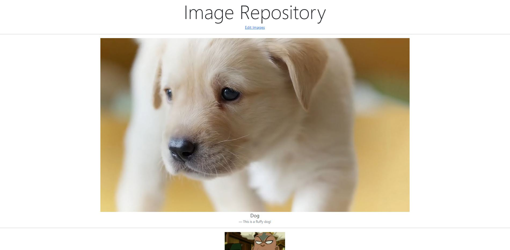
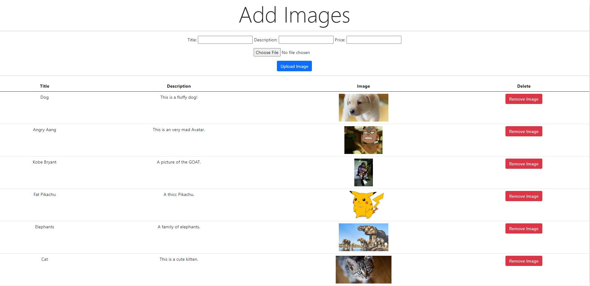

# Image-Repository
A quick, simple image gallery made using the Django framework and Bootstrap 5.0. Part of the 2021 Shopify Backend Developer Intern Challenge.

To set up:
 - Clone repo locally
 - open terminal
 - make your way to /Image-Repository/imagerepository
 - python manage.py runserver

The Main Page:

The Editing Page:

